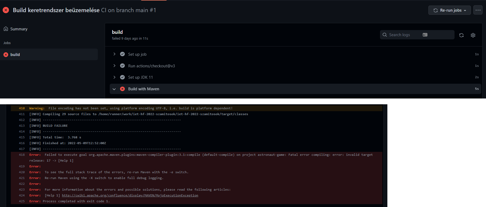
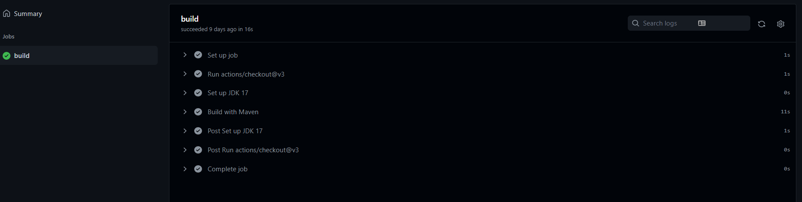

# Build keretrendszer beüzemelése

A házi feladat elkészítéséhez a Szoftver Projekt Laboratórium (BMEVIIIAB06) tárgy keretében elkészített Java játékunkat választottuk. Korábban a játék elkészítése során nem használtunk semmilyen build eszközt, csak az Eclipse IDE funkcióit használva fejlesztettünk. Emiatt csak az elkészült Java forrásfájlok álltak rendelkezésre, így célszerűnek tűnt a Mavent választanunk a projekthez. Első lépésben egy üres Maven projektet kellett lérehozni, amelybe be lettek importálva a korábban elkészült forrásfájlok. Ezek a lépések ugyan még nem a CI pipeline beüzemeléséhez tartoztak, inkább a projekt kezdeti állapotba helyezésének tekintetőek, ezért ezt nem külön branchen és pull requestben végeztük el. 

Következő lépésben a GitHub Actions funkciót kihasználva új workflowt hoztunk létre. A .github/workflows mappában létrehoztuk a ci-main.yml fájlt, amelyben a CI lépéseket konfiguráltuk be. A commit historyban is látható, hogy az első verzió hibás Java verziót használt, ezért a build nem is sikerült.

A hiba javítása után sikeresen lefutott a teljes workflow.

