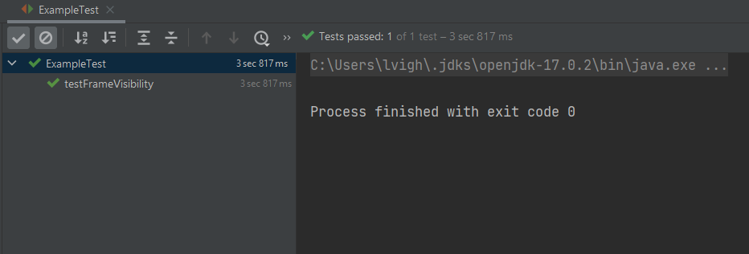

# Megfelelő Swing UI teszt keretrendszer keresése és beüzemelése

A feladat keretében olyan teszt keretrendszer keresése és kipróbálása volt a feladatom, amely segítségével automata teszteket lehet készíteni az általunk választott Java Swing alapú játékhoz. Ez kihívás volt, hiszen a Swing önmagában egy régi és elavultnak számító GUI keretrendszer. Számos lehetőséget mérlegelve a választásom a FEST (https://code.google.com/archive/p/fest/) teszt keretrendszerre esett mivel JUnit kompatibilis és megtalálható Maven Central Repositoryban. Így a szükséges Maven függőségeket felvettem a pom.xml fájlban és egy példa tesztosztályt készítettem, amely csapattársaimnak mintául szolgál a GUI tesztek írásához.

A példa teszt keretében létrehozom a játék fő paneljét és ellenőrzöm, hogy az ablak látható-e.

