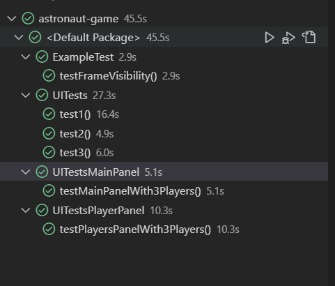

# Swing UI tesztek implementálása

A FEST keretrendszerre építve írtam meg az előre megbeszélt és megtervezett UI teszteket (issue 4).
Minden frame-re külön fileban lettek a tesztek.
Módosítottam a Program egyes elemeit, hogy használhatóak lehessenek a FEST-el.
Sikeresen lefutottak a tesztek.

